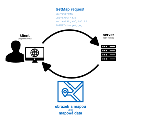
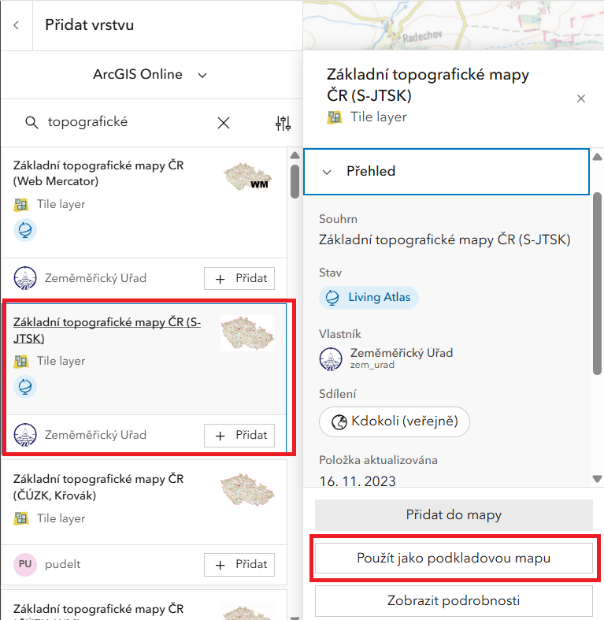
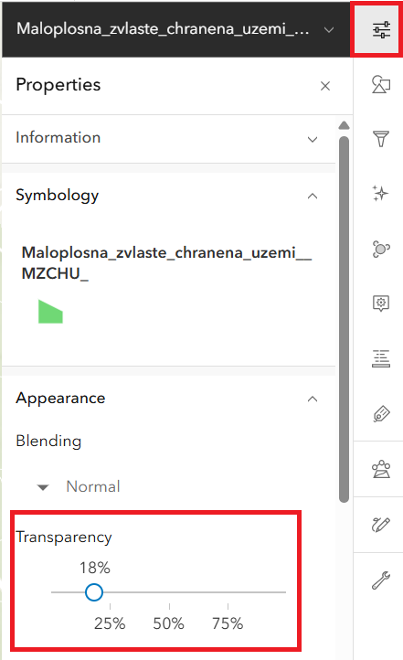
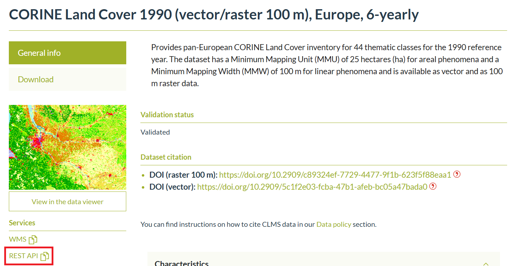
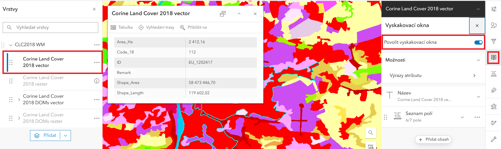

# Práce s webovými mapovými službami

## Cíle cvičení

 <!-- specificky format gridu (trida "grid_icon_info") na miru uvodni strance predmetu -->

-   :fontawesome-regular-handshake:{ .xl }

    __seznámení s prostředím__ webového systému ArcGIS&nbsp;Online

-   :material-layers-triple-outline:{ .xl }

    __shrnutí datových zdrojů__ webových mapových vrstev

-   :material-map-outline:{ .xl }

    __přidávání dat do mapy__ (ze serverů různých poskytovatelů)

-   :material-map-marker-plus-outline:{ .xl }

    __extrakce informací__ z více vrstev ke konkrétnímu místu

## Prostorová data
Prostorová data (geodata) jsou data, která obsahují informaci o konkrétní geografické poloze objektů na Zemi. Poloha může být přímo (souřadnice objektu) či nepřímo (např. adresou). Informace o poloze obvykle bývá doplněna o informaci vlastnostech *(atributech)* objektu, která jsou uložena v atributové tabulce. Dva nejběžnější datové formáty používané k ukládání (geo)prostorových dat jsou vektorové (body, linie, plochy) a rastrové (satelitní snímky, digitální modely terénu).

???+ note-fg-color "Atributy (geo)prostorových dat"

    Podstatnou částí geoprostorových dat jsou atributy. Jedná se o __doplňkové informace přiřazené ke každému prvku__ a uspořádané ve formě tzv. __atributové tabulky__. Sloupce této tabulky jsou tzv. __:octicons-columns-16: atributy__, řádky jsou tzv. __:octicons-rows-16: záznamy__. Každý atribut má svůj název a datový typ (např. celé číslo, des. číslo, text, datum). V záznamu nemusí být nutně vyplněny všechny atributy (záleží na nastavení databáze).

    {width=50% .no-filter}
    {align="center"}

    Zobrazování atributů konkrétního prvku probíhá nejčastěji formou tzv. __vyskakovacího okna__ (pop-up window). Tento prvek uživatelského rozhraní se __objeví po kliknutí na prvek v mapě__ a ve výchozím stavu zobrazuje __tabulku s atributy pro daný prvek__.  Atributy se v geomatice používají pro __filtrování prvků__ (zobrazení/skrytí) nebo __řízení symbologie__ (např. obarvení budov podle počtu podlaží).

    {width=50% .no-filter}
    {align="center"}

    <figcaption>vyskakovací okno (po kliknutí na prvek)</figcaption>

 

    <iframe width="100%" height="400" frameborder="0" scrolling="no" marginheight="0" marginwidth="0" src="https://experience.arcgis.com/experience/0d0ade6e797e419d8e73fd28b8704c5a"></iframe>

<!--
style="border: .05rem solid #ededed; border-radius: .1rem;"-->

???+ note-fg-color "Vektorová vs. rastrová data"
    

    -   :material-vector-polyline:{ .lg .middle } __Vektorová data__

        ---

        Reprezentují prvky reálného světa pomocí základních geometrických elementů: __bodů, linií a ploch__ (tzv. polygonů)

        Podrobnost dat je určena __podrobností souřadnic vrcholů__ geometrického prvku

        Vhodné pro modelování a analýzu __diskrétních objektů__ (např. poloha bodů, kategorie pokrytí půdy)

        Vhodné pro __tvorbu map, měření délek, geometrické výpočty__

        Možné problémy s __topologií__ (mezery a překryvy)

        Základními formáty vektorových dat jsou __Esri Shapefile, GeoJSON, GeoPackage__ či __KML/GML__

    -   :material-grid:{ .lg .middle } __Rastrová data__

        ---

        Reprezentují prvky reálného světa v podobě pravidelné mřížky tvořené tzv. __pixely__ (z angl. *picture element*)

        Podrobnost dat je určena __prostorovým rozlišením__ rastru, tj. __velikostí__ hrany __pixelu__ (v metrech)

        Vhodné pro modelování a analýzu __spojitých jevů__ (nadmořská výška, teplota, srážky)
        
        Využívané pro __obrazová data__ (např. satelitní snímky)

        Nevýhodou velikost souborových dat

        Základními formáty rastrových dat jsou __GeoTIFF, JPEG, PNG__ či __GIF__

    

    <figure markdown>
    { width=400px }
    <figcaption>Rozdíl v grafické reprezentaci vektorových a rastrových dat (Geletič et al. 2019)</figcaption>
    </figure>

## Mapové služby

Mapové služby jsou __webové nástroje poskytující geoprostorová data__ ze serveru na klienta __prostřednictvím internetu__. Klientem je (zjednodušeně) zařízení uživatele (např. webový prohlížeč) vysílající požadavek pro získání dat ze serveru. V praxi se většinou __klient služby dotazuje pomocí GIS aplikace__ (webové či desktopové), která na pozadí posílá serveru požadavky a následně zobrazuje přijatá data (viz obrázek). Díky vazbě dat na souřadnicový systém lze takto __kombinovat data s různými rozsahy a z různých zdrojů v jednom mapovém okně__ a data se zobrazí polohově správně.

{ .no-filter width=700px}
{align=center}

Pro mapové služby existují různé __standardy komunikace__:

- [OGC]("Open Geospatial Consortium") standardizované otevřené formáty: 
    - __WMS (Web Map Service)__: umožňuje sdílení geografické informace ve formě rastrových dat v prostředí Internetu
    - __WFS (Web Feature Service)__: umožňuje sdílení geografické informace ve formě vektorových dat v prostředí Internetu

- proprietární standard společnosti [Esri]("ESRI (Environmental Systems Research Institute) je společnost zabývající se vývojem softwaru určeného pro práci s geografickými informačními systémy"):
    - __ArcGIS REST__

???+ note-fg-color "Kde hledat mapové služby?"
    - geoportály (např. metadatový katalog [Národního geoportálu INSPIRE](https://geoportal.gov.cz/web/guest/home/){.color_def .underlined_dotted .external_link_icon target="_blank"})
    - webové stránky poskytovale (např. [Evropská agentura pro životní prostředí (EEA)](https://land.copernicus.eu/en/products/corine-land-cover?tab=main){ .color_def .underlined_dotted .external_link_icon target="_blank"})
    

## Geoportály

Geoportály jsou webové platformy, které poskytují přístup k geografickým datům a službám. Slouží jako centrální bod pro vyhledávání, prohlížení a stahování prostorových informací, jako jsou mapy, letecké snímky, katastrální data nebo údaje o životním prostředí. Mohou představovat cenný zdroj dat pro analýzu a plánování projektů. Lze zde například využít data o reliéfu terénu, dopravní infrastruktuře nebo vlastnických vztazích k pozemkům. Geoportály často nabízejí i nástroje pro prostorovou analýzu a vizualizaci dat, což může pomoci lépe porozumět kontextu projektů. Geoportály v širším slova smyslu představují také důležitý nástroj v územním plánování a správě měst. Umožňují veřejnosti i odborníkům přístup k aktuálním a relevantním informacím o daném území. Uživatelé mohou využít geoportály k získání podkladů pro své projekty, ale také k prezentaci svých návrhů veřejnosti. Díky geoportálům se stává územní plánování transparentnější a efektivnější, což přispívá k lepšímu rozvoji měst a regionů.

__Tipy na některé zajímavé geoportály:__

[Geoportál ČÚZK](https://geoportal.cuzk.cz/ "Český úřad zeměměřický a katastrální"){ .md-button .md-button--primary .button_smaller .external_link_icon target="_blank"}
[Geoportál AOPK](https://gis-aopkcr.opendata.arcgis.com/ "Agentura přírody a krajiny"){ .md-button .md-button--primary .button_smaller .external_link_icon target="_blank"}
[Geoportál ČSÚ](https://geodata.statistika.cz/portal/apps/sites/#/homepage "Český statistický úřad"){ .md-button .md-button--primary .button_smaller .external_link_icon target="_blank"}
[Geoportál Praha](https://geoportalpraha.cz/ "IPR Praha"){ .md-button .md-button--primary .button_smaller .external_link_icon target="_blank"}
[Geoportál města Brna](https://data.brno.cz/ "Magistrát města Brna"){ .md-button .md-button--primary .button_smaller .external_link_icon target="_blank"}
{.button_array}

## ArcGIS Online

[__ArcGIS Online__](https://www.arcgis.com/){.color_def .underlined_dotted .external_link_icon target="_blank"} je cloudová platforma pro geografické informační systémy od společnosti Esri. Umožňuje uživatelům vytvářet, sdílet a analyzovat mapy a geografická data prostřednictvím webového prohlížeče. ArcGIS Online představuje cenný nástroj pro vizualizaci a analýzu prostorových dat, jako mohou být urbanistické plány, dopravní sítě, demografické údaje nebo informace o životním prostředí. Platforma nabízí širokou škálu nástrojů pro tvorbu interaktivních map, 3D modelů a webových aplikací, které mohou být využity při plánování a prezentaci projektů.  Díky ArcGIS Online mohou uživatelé snadno integrovat různé zdroje dat, provádět prostorové analýzy a vytvářet vizuálně atraktivní prezentace svých návrhů. Platforma také podporuje spolupráci a sdílení dat mezi uživateli, což umožňuje studentům a pedagogům efektivněji pracovat na společných projektech. ArcGIS Online je tak vhodným nástrojem pro moderní geografické vzdělávání, který studentům umožňuje rozvíjet dovednosti v oblasti prostorové analýzy a vizualizace.

## Zadání úlohy

Je dán __bod o zeměpisných souřadnicích__ dle individuálního zadání (viz níže).

??? task-fg-color "Individuální zadání"
    - také viz [Moodle](https://moodle-vyuka.cvut.cz/mod/page/view.php?id=363759){.color_def .underlined_dotted .external_link_icon target="_blank"}  
    <iframe src="https://docs.google.com/spreadsheets/d/e/2PACX-1vRxRPIWMyUuEA30Y8UhDF8f-T56L_N9MBSQeZ5eaw8GshZeA9MeO4aFCUhp3AnsT65sS3914Sjd8elH/pubhtml?gid=0&single=true" width="100%" height="500" frameBorder="0"></iframe>

S využitím __mapové prohlížečky__ [__ArcGIS Online__](https://www.arcgis.com/){.color_def .underlined_dotted .external_link_icon target="_blank"}, __mapových služeb__ či __geoportálů__ o zadaném bodu zjistěte:

1. __příslušnost k obci__ a v jakém __katastrálním území__ bod leží

    - využijte vrstev __:material-layers: Obec__{.bg} a __:material-layers: KatastralniUzemi__{.bg} z [__Geoprohlížeče ČÚZK__](https://ags.cuzk.gov.cz/geoprohlizec/ "Produkty → RUIAN"){.color_def .underlined_dotted .external_link_icon target="_blank"} (prohlížecí služba databáze RÚIAN). __(4)__{title="zadání souřadnic bodu"}
    
    - jako odpověď uveďte přesný __název obce__{.outlined} a __název a číslo katastrálního území__{.outlined}
          
---

2. __geologické podloží__ pod zadaným bodem

    - využijte vhodné vrstvy ze stránek [__České geologické služby__](https://cgs.gov.cz/ "Webové služby → geologie (27) → Geologická mapa 1 : 50 000 (GEOČR50)"){.color_def .underlined_dotted .external_link_icon target="_blank"} 
    *(Pro zobrazení atributů je nutné nejprve povolit vyskakovací okna)*
    __(13)__{title="aktivace vyskakovacích oken"}
    - jako odpověď uveďte atributy __hornina__{.outlined} a __horninový typ__{.outlined}

---

3. adresu nejbližšího __adresního bodu__

    - využijte vrstvy __:material-layers: AdresniMisto__{.bg} z [__Geoprohlížeče ČÚZK__](https://ags.cuzk.gov.cz/geoprohlizec/){.color_def .underlined_dotted .external_link_icon target="_blank"} (prohlížecí služba databáze RÚIAN).
    - jako odpověď uveďte __přesnou adresu__{.outlined} (z atributu)

---

4. poštovní směrovací číslo nejbližší __pobočky České pošty__ (__pouze pobočky, ne výdejní boxy apod.__ – zde si vyzkoušíte funkci **filtrování dat** __(5)__{title="funkce Filter data"})

    - využijte vrstvy __:material-layers: Pobočky České pošty__{.bg} od [__České informační agentury životního prostředí__](https://gis.cenia.cz/geoserver/pobocky_ceske_posty/wfs?SERVICE=WFS&request=GETCapabilities "adresu odkazu lze přímo použít jako mapovou vrstvu"){.color_def .underlined_dotted .external_link_icon target="_blank"} (CENIA) s nastaveným tak, že atribut **`ZKR_NAZ_FUN` nabývá hodnot `Podávací`, `Samostatná pošta Partner`, `Dodejna I`, `Dodejna II` a `Samostatná dodejna`** __(6)__{title="ukázka použití filtru nad vrstvou"}
    - jako odpověď uveďte __pětimístné poštovní směrovací číslo nejbližší pobočky__{.outlined} 

---

5. __nadmořskou výšku lokality__

    - výšku odečtěte ze __tří různých mapových podkladů__{.primary_color} ~~a __výsledky porovnejte__~~
    - doporučenými zdroji jsou např. 
    [__Základní topografické mapy ČR__](https://ags.cuzk.cz/geoprohlizec/ "obsahují vrstevnice s popisy výšky"){.color_def .underlined_dotted .external_link_icon target="_blank"}, webová aplikace 
    [__Analýzy výškopisu__](https://ags.cuzk.cz/av/ "režim Výpis souřadnic bodu (výškový systém Bpv (m))"){.color_def .underlined_dotted .external_link_icon target="_blank"} 
    (ČÚZK) nebo mapový portál 
    [__Mapy.cz__](https://mapy.cz/ "funkce Měření → Výškový profil"){.color_def .underlined_dotted .external_link_icon target="_blank"}
    - jako odpověď uveďte __3 hodnoty nadmořské výšky včetně zdroje každé z nich__{.outlined}

---

6. k jaké __změně využití území__ v zadaném bodě došlo mezi lety 1990 a 2018

    - využijte data evropského programu [__Copernicus__](https://www.copernicus.eu/cs "program EU pro družicové pozorování Země v zájmu obecného užitku všech občanů"){.color_def .underlined_dotted .external_link_icon target="_blank"} – __:material-layers: Corine Land Cover Europe__{.bg .color_def target="_blank"}
    - dostupné ze stránek &nbsp;[__Evropské agentury pro životní prostředí (EEA)__](https://land.copernicus.eu/en/products/corine-land-cover?tab=main){ .color_def .underlined_dotted .external_link_icon target="_blank"}&nbsp; či &nbsp;[__Copernicus Land Monitoring Service (CLMS)__](https://www.eea.europa.eu/en/datahub/datahubitem-view/a5144888-ee2a-4e5d-a7b0-2bbf21656348){ .color_def .underlined_dotted .external_link_icon target="_blank"} 
    *(Ze stránek EEA či CLMS použijte mapovou službu 'REST API', resp. 'ESRI: REST', u WMS bohužel není v tomto případě možné vyčítat hodnoty atributů vrstvy. Pro zobrazení atributů je nutné nejprve povolit vyskakovací okna)*
    __(11)__{title="mapová služba REST"} __(12)__{title="aktivace vyskakovacích oken"}
    - jako odpověď uveďte __kód a slovní název kategorie Land Cover pro obě období__{.outlined} a __jejich slovní porovnání__{.outlined}

---
<!--
7. ~~zda dochází v lokalitě k překročení hodnoty 20 µg/m³ u roční průměrné koncentrace suspendovaných prachových částic PM10 a jakých hodnot v ng/m³ dosahují roční průměrné koncentrace benzoapyrenu (použijte službu III_5_7_8_CHMU_ovzdusi z ArcGIS Online, vrstva ČHMÚ ovzduší – Koncentrace látek znečišťujících ovzduší v gridu 1x1 km, rok 2019)~~

    - ~~využijte vrstvy od [__České informační agentury životního prostředí__](https://gis.cenia.cz/geoserver/chmu_ovzdusi/wfs?SERVICE=WFS&request=GETCapabilities "adresu odkazu lze přímo použít jako mapovou vrstvu"){.color_def .underlined_dotted .external_link_icon target="_blank"} (CENIA).~~

---
-->
7. jaké hodnoty dosahovala v zadané lokalitě __intenzita světelného znečištění__ v roce 2022

    - využijte vrstvy __:material-layers: Světelné znečištění v ČR za rok 2022__{.bg} od [__České informační agentury životního prostředí__](https://tiledimageservices2.arcgis.com/LlQJoYHf9cwrM7NJ/arcgis/rest/services/raster01_final3crf/ImageServer "adresu odkazu lze přímo použít jako mapovou vrstvu"){.color_def .underlined_dotted .external_link_icon target="_blank"} (CENIA). <figcaption>(vrstva byla přepublikována pro účely výuky – odkaz proto nevede přímo na server agentury CENIA)</figcaption>
    - jako odpověď uveďte __hodnotu intenzity znečištění z rastru v rozmezí 1 až 5__{.outlined}

    <!--  Puvodni vrstva ZDE: https://gis.cenia.cz/geoserver/svetelne_znecisteni/wms?service=WMS&request=GetCapabilities  -->

---

8. příslušnost zadané lokality ke __stavebnímu a matričnímu úřadu__

    - využijte vrstvy __:material-layers: Působnost úřadů__{.bg} od [__České informační agentury životního prostředí__](https://gis.cenia.cz/geoserver/pusobnost_uradu/wfs?SERVICE=WFS&request=GETCapabilities "adresu odkazu lze přímo použít jako mapovou vrstvu"){.color_def .underlined_dotted .external_link_icon target="_blank"} (CENIA).
    - jako odpověď uveďte __název příslušného úřadu (pro oba typy instituce)__{.outlined}

---

<!--
DALŠÍ TIPY (nalezeno na Cenii):

Světelné znečištění: https://gis.cenia.cz/geoserver/svetelne_znecisteni/wms?service=WMS&request=GetCapabilities
Úřady: https://gis.cenia.cz/geoserver/pusobnost_uradu/wms?service=WMS&request=GetCapabilities
Školy a školská zařízení: https://gis.cenia.cz/geoserver/skoly/wms?service=WMS&request=GetCapabilities
Pobočky České pošty (je tam problém, že to bere i Pošta Partner, Balíkovny a jiná místa): https://gis.cenia.cz/geoserver/pobocky_ceske_posty/wms?service=WMS&request=GetCapabilities
Ovzduší: https://gis.cenia.cz/geoserver/chmu_ovzdusi/wms?service=WMS&request=GetCapabilities

Další zajímavé vrstvy zde (ale mám problém s popupem!): https://gis.cenia.cz/geoserver/ows?service=WMS&version=1.3.0&request=GetCapabilities

ALE POZOR! VSECHNY TY VRSTVY MAJI I WFS A TA FUNGUJE!!!
STACI PREPSAT NA: https://gis.cenia.cz/geoserver/pobocky_ceske_posty/wfs?SERVICE=WFS&request=GETCapabilities
WFS jede v AGOLu i v Geoprohlizeci (paradoxne v Procku to ma trochu problemy)

zde zajimava informace o WMS: https://community.esri.com/t5/arcgis-api-for-silverlight-questions/direct-link-to-wms-sub-layer/td-p/171686

-->

&nbsp;

__Dále vytvořte a vyexportujte mapové kompozice:__

<!-- div je zde kvuli anotacim -->

9. využití území dle __:material-layers: CORINE Land Cover 2018__{.bg} __(3)__{title="legenda Corine Land Cover"} nad __:material-layers: Základní topografickou mapou__{.bg}, __měřítko volte 1 : 10 000__ __(10)__{title="nastavení měřítka při exportu mapy"}, __formát A4 landscape__ __(1)__{title="ukázka řešení"}

    - Základní topografická mapa je k dispozici např. na [__Geoportálu ČÚZK__](https://geoportal.cuzk.cz/ "Služby → Prohlížecí → Esri ArcGIS Server (nebo WMS)"){.color_def .underlined_dotted .external_link_icon target="_blank"}, lze ji také vyhledat v prostředí [__ArcGIS Online__](https://www.arcgis.com/ "služba 'Základní topografická mapa' od uživatele 'daniel.kolias_tonaso'"){.color_def .underlined_dotted .external_link_icon target="_blank"}
    - výchozí podkladová mapa ArcGIS Online __není součástí správného výsledku__{.primary_color}. Pro správný výsledek je nutné podkladovou mapu změnit na oficiální [__Základní topografickou mapu od Zeměměřického úřadu v souřadnicovém systému S-JTSK__]("v prostředi AGOL odpovídá službě 'Základní topografické mapy ČR (S-JTSK)' od uživatele 'Zeměměřický Úřad'"){.color_def .underlined_dotted} __(7)__{title="přidejte ZTM jako podkladovou mapu"}.

---

10. nejbližšího __maloplošného chráněného území__{.underlined_dotted title="přír. památka, přír. rezervace, nár. přír. památka, nár. přír. rezervace"} přírody (nikoli okolí Vašeho bodu, ale okolí chráněného území) <!--__s popiskem__{.primary_color}--> nad __:material-layers: Základní topografickou mapou__{.bg}, __měřítko kompozice a orientaci papíru A4 volte tak, aby se dané chráněné území optimálně vešlo__ __(2)__{title="ukázka řešení"}

    - využijte vrstvu z [__Geoportálu Agentury ochrany přírody a krajiny ČR__](https://gis-aopkcr.opendata.arcgis.com/){.color_def .underlined_dotted .external_link_icon target="_blank"} (AOPK), vrstvu lze vyhledat také v prostředí [__ArcGIS Online__](https://www.arcgis.com/ "služba 'Maloplošná zvláště chráněná území' od uživatele 'aopkcr'"){.color_def .underlined_dotted .external_link_icon target="_blank"}
    - výchozí podkladová mapa ArcGIS Online __není součástí správného výsledku__{.primary_color}. Pro správný výsledek je nutné podkladovou mapu změnit na oficiální [__Základní topografickou mapu od Zeměměřického úřadu v souřadnicovém systému S-JTSK__]("v prostředi AGOL odpovídá službě 'Základní topografické mapy ČR (S-JTSK)' od uživatele 'Zeměměřický Úřad'"){.color_def .underlined_dotted} __(8)__{title="přidejte ZTM jako podkladovou mapu"}.

---

K vytvoření kompozic využijte platformu 
[__ArcGIS Online__](https://www.arcgis.com/ "pouze v ArcGIS Online lze nastavit přesné měřítko"){.color_def .underlined_dotted .external_link_icon target="_blank"}, 
[__Geoprohlížeč ČÚZK__](https://ags.cuzk.cz/geoprohlizec/){.color_def .underlined_dotted .external_link_icon target="_blank"} či 
[__Národní geoportál INSPIRE__](https://geoportal.gov.cz/web/guest/about-inspire){.color_def .underlined_dotted .external_link_icon target="_blank"} 
a __příslušné datové vrstvy__. Vrstvy prolněte __pomocí nástrojů průhlednosti vrstev__ __(9)__{title="nastavení průhlednosti vrstvy"}. Kompozice exportujte do formátu PDF či PNG (funkce Print) a __vložte do technické zprávy__.

1.  { .no-filter width=700px} vytvořeno nástrojem Print v ArcGIS Online
2.  { .no-filter width=700px} vytvořeno nástrojem Print v ArcGIS Online
3.  { .no-filter width=900px} legenda k datům Corine Land Cover
4.  { .no-filter width=600px} zadání souřadnic bodu v Geoprohlížeči ČÚZK
5.  { .no-filter width=700px} funkce pro filtrování dat 
6.  { .no-filter width=700px} nastavení filtru
7.  { .no-filter width=700px} nastavení ZTM jako podkladové mapy
8.  { .no-filter width=700px} nastavení ZTM jako podkladové mapy
9.  { .no-filter width=700px} nastavení průhlednosti vrstvy
10. { .no-filter width=700px} nastavení měřítka při exportu mapy
11. { .no-filter width=700px} výběr mapové služby REST
12. { .no-filter width=700px} aktivace vyskakovacích oken
13. { .no-filter width=700px} aktivace vyskakovacích oken

## Výstupy cvičení

Povinným výstupem úlohy je __technická zpráva v elektronické podobě__{.outlined} odevzdaná v termínu prostřednictvím systému [__Moodle__](https://moodle-vyuka.cvut.cz/mod/assign/view.php?id=363757){.color_def .underlined_dotted .external_link_icon target="_blank"}.

Termín pro odevzdání úlohy: __neděle 23. března, 23.59 hod__{.outlined} 

??? task-fg-color "Výstup cvičení: Technická zpráva (ukázka)"

    <iframe src="https://drive.google.com/file/d/1ZqcjTFb2wTY1slDzBp9NWATWiMmgRROJ/preview" width="100%" height="100%" style="border:0;"></iframe>
    {.custom_height}

Úloha je uznána, pokud technická zpráva obsahuje __všechny požadované náležitosti__ (viz níže) a má __správný formát__ (PDF).

???+ note-grey "Požadované náležitosti technické zprávy"
    - Formát odevzdání __:material-file: PDF__, název souboru __U4_Prijmeni_Jmeno.pdf__{.no-dec .outlined}, případně __U4_Prijmeni_Jmeno_oprava01.pdf__{.no-dec .outlined}
    - Rozpiska se __jménem__, __názvem úlohy__, __individuálním číslem zadání__ a __souřadnicemi zadaného bodu__
    - __Odpovědi__ na všechny otázky v zadání úlohy __včetně zdrojů__ – __jako zdroj nelze uvést pouze "ArcGIS Online" – tato služba je pouze prohlížečka, uvedení jako zdroj proto nedává smysl. Zdrojem získaných informací jsou konkrétní datové vrstvy – na ty lze odkazovat jejich přesným názvem a URL adresou služby.__{style="color:#c22521;" .icon-exclm .no-dec}
    - __Grafické přílohy__ dle zadání (podúlohy __9__{.no-dec .outlined} a __10__{.no-dec .outlined} )
    - __Závěr__ s krátkým (3 až 6 vět) objektivním hodnocením výsledků úlohy. Lze např. zhodnotit, proč jsou některé výsledky takové, jaké jsou. Nebo zmínit využití podobné úlohy ve vašem oboru.

### Opravy

V případě, že odevzdaný výstup není správný, je vyučujícím prostřednictvím systému Moodle __vrácen k opravě__. Opravený výstup se odevzdává opět prostřednictvím systému [__Moodle__](https://moodle-vyuka.cvut.cz/mod/assign/view.php?id=363757){.color_def .underlined_dotted .external_link_icon target="_blank"}. Výstup lze odevzdat po __maximálně jedné opravě__, v případě pozdního odevzdání či nesprávného výstupu po první opravě je úloha __trvale označena jako nesplněná__{style="color:#c22521;"}.

[Tabulka hodnocení úloh](https://docs.google.com/spreadsheets/d/1oa_5s2p5B-eIXSad0H14NJTzTYX3YhDc9FUlwDHvrrc/edit?gid=0#gid=0){ .md-button .md-button--primary target="_blank"}
{align=center}

     

<!--

-->