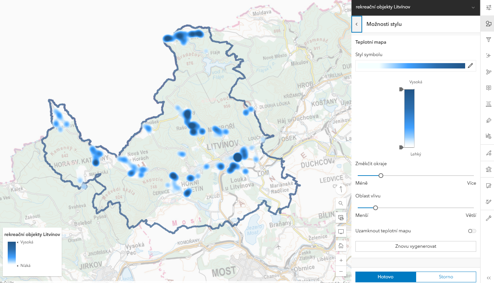
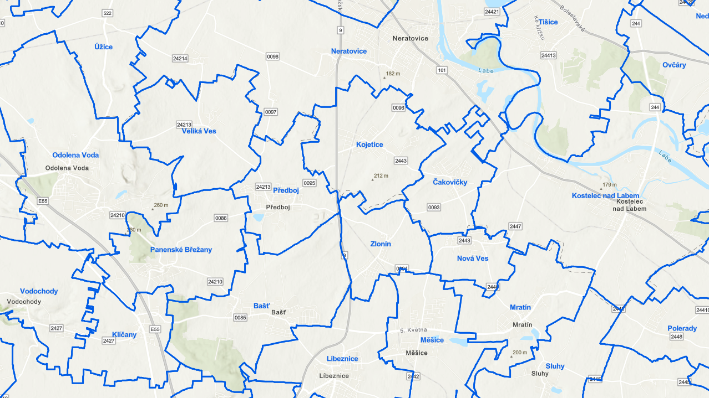

# Tvorba webové mapy

## Cíle cvičení

 <!-- specificky format gridu (trida "grid_icon_info") na miru uvodni strance predmetu -->

-   :material-map-search-outline:{ .xl }

    vytvoření __interaktivní webové mapy__ s vlastním obsahem

-   :material-chart-box-multiple:{ .xl }

    procvičení jednoduchých __GIS analýz__

-   :material-map-marker-multiple-outline:{ .xl }

    nastavení základní __mapové symboliky__

-   :material-map-outline:{ .xl }

    seznámení s __vybranými metodami tematické vizualizace__

<!--
## Základní topografická mapa a ZABAGED-->
<!--
**Základní topografická mapa ČR (ZTM ČR)**-->
<!--
Základní topografické mapy ČR představují soubor mapových děl, které poskytují podrobné a aktuální informace o území České republiky. Jedná se o nejpodrobnější obecně topografické mapové dílo České republiky. Mapy jsou vytvářeny v měřítcích od 1 : 5000 po 1 : 200 000, s přehlednými mapami o půlmilionovém a milionovém měřítku) a slouží jako základní zdroj geografických dat pro široké spektrum uživatelů, včetně veřejné správy, odborníků i veřejnosti. 
ZTM ČR se vytváří digitální technologií z kartografické databáze, která je aktualizována na základě Základní báze geografických dat České republiky (ZABAGED) a databáze geografických jmen České republiky Geonames. Mapy obsahují informace o terénu, vodstvu, sídelní struktuře, dopravní síti, vegetaci a dalších prvcích krajiny.
{style="color:grey;"}-->

<!--**ZABAGED (Základní báze geografických dat České republiky)**

ZABAGED je vektorový geografický digitální model území České republiky, který spravuje Zeměměřický úřad. Tato databáze obsahuje podrobné a aktuální informace o polohopisu, výškopisu a dalších geografických prvcích území ČR, v měřítku odpovídajícím minimálně referenční hodnotě 5000, mnohdy ale v úrovni podrobnější. ZABAGED je základním zdrojem dat pro tvorbu ZTM ČR a dalších geografických informačních systémů. 
ZABAGED představuje důležitý zdroj dat pro analýzu území, tvorbu map a 3D modelů či vizualizací. Je využívána jako základní informační vrstva v územně orientovaných informačních a řídících systémech veřejné správy ČR.
{style="color:grey;"}

 -->

## Zadání úlohy

V prostředí [__ArcGIS Online__](https://www.arcgis.com/){.color_def .underlined_dotted .external_link_icon target="_blank"} vytvořte __2 webové mapy__ pro zadané území (viz individuální zadání níže): 

[**Mapa I**](#mapa-i) bude obsahovat __budovy (stavební objekty) v zadané obci__ __barevně rozlišené dle připojení na kanalizaci a plyn__.

[**Mapa II**](#mapa-ii) bude zobrazovat __rekreační potenciál v zadané [ORP]("obce s rozšířenou působností (ORP) jsou v Česku mezičlánkem přenesené působnosti samosprávy mezi krajskými úřady a ostatními obecními úřady") pomocí metody intenzity jevu (heat map)__.

??? task-fg-color "Individuální zadání"
    - také viz [Moodle](https://moodle-vyuka.cvut.cz/mod/page/view.php?id=363763){.color_def .underlined_dotted .external_link_icon target="_blank"}  
    <iframe src="https://docs.google.com/spreadsheets/d/e/2PACX-1vRxRPIWMyUuEA30Y8UhDF8f-T56L_N9MBSQeZ5eaw8GshZeA9MeO4aFCUhp3AnsT65sS3914Sjd8elH/pubhtml?gid=1732083778&single=true" width="100%" height="500" frameBorder="0"></iframe>

## Mapa I

- Do prázdné mapy v ArcGIS Online __přidejte polygonovou vrstvu obcí__ [__:material-layers-triple: SGEA_obce_2025__]("Tato vrstva obsahuje polygony území všech obcí v ČR."){.bg .color_def}. __(1)__{title="ukázka polygonové vrstvy obcí"}

- S využitím funkce __:material-filter: filtru__ __omezte vrstvu obcí pouze na území zadané obce.__ Nastavte :material-filter: filtr dle atributu `Kód obce`. __(2)__{title="nastavení filtru dle kódu obce"}

- Dále přidejte polygonovou vrstvu [__:material-layers-triple: StavebniObjekt__]("Tato vrstva obsahuje polygony všech stavebních objektů v ČR."){.bg .color_def} z mapové služby __:material-layers: RÚIAN__{.bg} z [__Geoportálu ČÚZK__](https://ags.cuzk.gov.cz/geoprohlizec/ "Produkty → RÚIAN"){.color_def .underlined_dotted .external_link_icon target="_blank"}. Vrstvě stavebních objektů vhodně nastavte viditelný rozsah, aby bylo možné stavební objekty zobrazit i v menším měřítku (postačí do úrovně měst). __(3)__{title="přidání vrstvy stavebních objektů"}__(13)__{title="nastavení viditelného rozsahu vrstvy"}

- S využitím nástroje __prostorové analýzy__ [__:material-tools: Překrýt vrstvy__]("angl. Overlay Layers"){.bg .color_def} __vytvořte vrstvu stavebních objektů pouze na území zadané obce__.__(4)__{title="nastavení parametrů nástroje překrytí vrstev"}__(5)__{title="ukázka výstupu nástroje překrytí vrstev"} 
    *(Před spuštěním nástroje nastavte mapové okno tak, aby byla __viditelná celá hranice zadané obce__. Následně nastavte parametr __"Nastavení prostředí"__ nastavte na __"Rozsah zobrazení"__ , čímž omezíte výpočet pouze na rozsah mapového okna a výrazně tak snížíte cenu výpočtu)* __(14)__{title="omezení výpočtu dle rozsahu mapového okna"}

- Vhodným __nastavením :material-shape-outline: stylu__ nově vzniklé vrstvy __barevně odlište jednotlivé stavební objekty__ v zadané obci __dle atributu "Připojení na kanalizační síť"__:
    1. Číselné kódy nejprve seřaďte (vzestupně) a poté je přepište na slovní popisy dle následujícího klíče:    

 <!-- https://squidfunk.github.io/mkdocs-material/reference/grids/#using-generic-grids -->

__:material-pipe: Připojení na kanalizační síť__
{align="center" style="margin:0px;"}

|KÓD| NÁZEV                     |
|---|---------------------------|
| 1 | Přípoj na kanalizační síť |
| 2 | Vlastní ČOV               |
| 3 | Žumpa, jímka, septik      |
| 4 | Bez kanalizace a jímky    |
| 8 | Nedefinováno              |
| 9 | Nezjištěno                |

__:material-gas-burner: Připojení na rozvod plynu__
{align="center" style="margin:0px;"}

|KÓD| NÁZEV                |
|---|----------------------|
| 1 |Plyn z veřejné sítě   |
| 2 |Plyn z dom. zásobníku |
| 3 |Bez plynu             |
| 8 |Nedefinováno          |
| 9 |Nezjištěno            |
| 51|Plyn v domě           |

- 
    2. Jednotlivým kategoriím nastavte barevnou výplň dle následujícíh kartografických zásad:
        - kategoriím typu `nedefinováno`, `nezjištěno`, `null`, `žádná hodnota` nastavte __šedou barvu__{style="color:grey;"}
        - ostatní __kategorie barevně rozlište dle stupně naplnění jevu__:
            - kategorii typu `Přípoj na kanalizační síť` odpovídajícím naplnění jevu nastavte __zelenou barvu__{style="color:green;"}
            - kategoriím typu `Vlastní ČOV` či `Žumpa, jímka, septik` na pomezí naplnění/nenaplnění jevu nastavte neutrální __žlutou__{style="color:#f2d14e;"}/__oranžovou barvu__{style="color:orange;"}
            - kategoriím typu `bez kanalizace` odpovídajícím nenaplnění jevu nastavte __červenou barvu__{style="color:red;"} __(6)__{title="ukázka správně navržené symbologie"}

- Duplikujte vrstvu stavebních objektů a vhodným __nastavením :material-shape-outline: stylu__ nově vytvořené kopie vrstvy __barevně odlište jednotlivé stavební objekty__ v zadané obci __dle atributu "Připojení na rozvod plynu"__ dle kartografických zásad uvedených výše.

- Jako podkladovou mapu přidejte [__Základní topografickou mapu od Zeměměřického úřadu v souřadnicovém systému S-JTSK__]("v prostředi AGOL odpovídá službě 'Základní topografické mapy ČR (S-JTSK)' od uživatele 'Zeměměřický Úřad'"){.color_def .underlined_dotted} nebo [__Ortofotomapu ČR (S-JTSK)__]("v prostředi AGOL odpovídá službě 'Ortofotomapa ČR (S-JTSK' od uživatele 'Zeměměřický Úřad'"){.color_def .underlined_dotted} __(15)__{title="přidání podkladové mapy"}

<!-- NEFUNGUJE MI TA ZMENA PROJEKCE, U TETO VRSTVY TO TREBA FUNGUJE: geoappext.nrcan.gc.ca/arcgis/rest/services/BaseMaps/CBMT3978/MapServer -->

- Proveďte finální úpravu webové mapy:
    - vrstvy klasifikující stavební objekty dle připojení na plyn a kanalizaci seskupte do skupiny *"stavební objekty"* a této skupině __nastavte exkluzivní viditelnost__, aby byla při přepínání viditelná vždy pouze jedna vrstva stavebních objektů __(8)__{title="nastavení exkluzivní viditelnosti skupiny vrstev"}
    - ve webové mapě __zachovejte pouze skupinu vrstev *"stavební objekty"* a vrstvu zobrazující hranice obce__ (ostatní vrstvy z mapy odstraňte)
    - __všechny vrstvy vhodně pojmenujte__
    - u podkladové mapy nastavte vhodnou míru průhlednosti __(16)__{title="nastavení průhlednosti podkladové mapy"}

- __Webovou mapu uložte__ s názvem **Prijmeni_Jmeno_SGEA2025_Mapa1** a __nastavte sdílení v rámci oganizace__. __(17)__{title="ukázka"}

<figure markdown>
{width=700px}
{align=center}
<figcaption>ukázka výsledné webové mapy</figcaption></figure>

<!--???+ task-fg-color "Výstup cvičení (Mapa I): Webová mapa (ukázka)"

    <iframe width="100%" height="400" frameborder="0" scrolling="no" marginheight="0" marginwidth="0" src="https://experience.arcgis.com/experience/0e6a7769af1d479489af74e2f98ca195"></iframe>
-->

<!--

{width=500px}
{align=center}
<figcaption>ukázka správného výsledku (webová mapa)</figcaption>

-->

---

## Mapa II
Úkolem je vytvořit mapu, která bude zobrazovat __rekreační potenciál v zadané [ORP]("obce s rozšířenou působností (ORP) jsou v Česku mezičlánkem přenesené působnosti samosprávy mezi krajskými úřady a ostatními obecními úřady") pomocí metody intenzity jevu (heat map)__. Ve webové mapě bude nakonfigurováno vyskakovací okno s grafem, který bude zobrazovat vývoj výstavby domů v jednotlivých obcích zadané ORP.

<!--
- ~~Obě vrstvy (stavební objekty i obvod zadané obce) __exportujte do formátu Shapefile__ a __stáhněte na disk počítače__.~~

- ~~Shapefile __konvertujte do formátu DXF__. Použijte například [tento](https://mygeodata.cloud/converter/shp-to-dxf){.color_def .underlined_dotted .external_link_icon target="_blank"} webový nástroj.~~

- ~~Konvertovaný soubor otevřete v CAD software a __vytvořte jednoduchý výkres__ obsahující pouze __obvod zadané obce__ a (jinou barvou) __obvody stavebních objektů__ v ní. Všechny objekty musí být ve formě linií. Výkres odevzdejte ve formátu PDF.~~

- Obě vrstvy (stavební objekty i obvod zadané obce) otevřete v programu __:simple-autocad: AutoCAD__ (pomocí doplňku [ArcGIS for AutoCAD](https://www.esri.com/en-us/arcgis/products/arcgis-for-autocad/overview){.color_def .underlined_dotted .external_link_icon target="_blank"})

- Vytvořte __jednoduchý výkres__ – kresbě nastavte __vhodnou symbologii__, přidejte __text s názvem obce__  a __exportujte do PDF__ (formát stránky A4), tento __výstup odevzdejte__.

???+ task-fg-color "Výstup cvičení (část druhá): Výkres (ukázka)"

    <iframe src="https://drive.google.com/file/d/1MSAjhVjESNXBqnbiRNS2tz16X78QGy1Q/preview" width="100%" height="400" style="border:0;"></iframe>

- Pomocí :simple-arcgis: ArcGIS Pro (desktopová verze platformy ArcGIS, mimo rozsah kurzu) lze CAD výkres generovat s rozlišením vrstev dle atributu (tedy například rozlišit stavební objekty dle připojení na kanalizační síť i v CAD výkresu)

{width=500px}
{align=center}
<figcaption>ukázka správného výsledku (CAD výkres)</figcaption>

-->

- Do prázdné mapy v ArcGIS Online __přidejte polygonovou vrstvu obcí__ [__:material-layers-triple: SGEA_obce_2025__]("Tato vrstva obsahuje polygony území všech obcí v ČR."){.bg .color_def}. __(1)__{title="ukázka polygonové vrstvy obcí"}

- S využitím funkce __:material-filter: filtru__ __omezte vrstvu obcí pouze na obce zadané ORP.__ Nastavte :material-filter: filtr dle atributu `Název ORP`. __(19)__{title="nastavení filtru dle kódu obce"}

- S využitím nástroje __prostorové analýzy__ [__:material-tools: Sloučit hranice__]("angl. Dissolve Boundaries"){.bg .color_def} __sloučíme jednotlivé obce do plochy zadané ORP__.__(11)__{title="nastavení parametrů nástroje pro sloučení hranic"} 
    *(Tentokrát nemusíme řešit zoom mapového okna a nastavení parametru v *"Nastavení prostředí"*, protože počet zpracovaných obcí je již omezen filtrem. Výsledkem této analýzy získáme oblast, ve které budeme zobrazovat rekreační potenciál)*.
    - V nastavení stylu definuje výsledné vrstvě širší okraj, aby byl rozsah ORP výrazný.__(20)__{title="ukázka výstupu nástroje pro sloučení hranic"}

- Dále __přidejte bodovou vrstvu budov individuální a hromadné rekreace__ [__:material-layers-triple: Stav_objekty_rekr_BOD__]("tato vrstva obsahuje budovy, jež jsou typu "stavba pro rodinnou rekreaci" (`Způsob využití = 8`) nebo "stavba ubytovacího zařízení" (`Způsob využití = 11`)"){.bg .color_def}. __(18)__{title="ukázka bodové vrstvy rekreačních objektů"}

- S využitím nástroje __prostorové analýzy__ [__:material-tools: Překrýt vrstvy__]("angl. Overlay Layers"){.bg .color_def} __vytvořte vrstvu rekreačních objektů pouze na území zadané ORP__.__(21)__{title="nastavení parametrů nástroje překrytí vrstev"}__(22)__{title="ukázka výstupu nástroje překrytí vrstev"} 
    *(Před spuštěním nástroje nastavte parametr __"Nastavení prostředí"__ na __"Vrstva"__  a zvolte vrstvu ORP. Tímto omezíte výpočet pouze na rozsah VAšeho ORP a výrazně tak snížíte cenu výpočtu)* __(12)__{title="omezení výpočtu dle rozsahu vrstvy"}

- Ve __:material-shape-outline: stylu__ nově vzniklé vrstvy rekreačních budov nastavte __symboliku na typ__ __Teplotní mapa__ a __zobrazte intenzitu výskytu rekreačních objektů__ v zadané ORP.  
    *(Volitelně můžete nastavit "Oblast vlivu" jednotlivých bodů nebo přenastavit barevnou stupnici a úroveň průhlednosti.)*

<figure markdown>
{width=700px}
{align=center}
<figcaption>tvorba mapy formou metody intenzity jevu (heat-map)</figcaption></figure>

- Pro vrstvu s hranicemi obcí zapněte vyskakovací okna a nakonfigurujte jejich obsah:
    - zobrazte pouze atributy (pole) `Název obce`, `Kód obce` a `Počet obyvatel`
    - přidejte sloupcový (pruhový) graf, který bude vykreslovat vývoj výstavby domů v obci s využitím atributů 
    `Výstavba domů před 1919`, `Výstavba domů 1920–1945`, `Výstavba domů 1946–1970`, ... , až po `Výstavba domů po 2016` (v tomto pořadí)

- Jako podkladovou mapu přidejte [__Základní topografickou mapu od Zeměměřického úřadu v souřadnicovém systému S-JTSK__]("v prostředi AGOL odpovídá službě 'Základní topografické mapy ČR (S-JTSK)' od uživatele 'Zeměměřický Úřad'"){.color_def .underlined_dotted} nebo [__Ortofotomapu ČR (S-JTSK)__]("v prostředi AGOL odpovídá službě 'Ortofotomapa ČR (S-JTSK' od uživatele 'Zeměměřický Úřad'"){.color_def .underlined_dotted} __(15)__{title="přidání podkladové mapy"}

- Proveďte finální úpravu webové mapy:
    - ve webové mapě __zachovejte pouze vrstvu rekreačních objektů v zadané ORP a vrstvu zobrazující hranice obcí a zadaného ORP__ (ostatní vrstvy z mapy odstraňte)
    - __všechny vrstvy vhodně pojmenujte__
    - možnost __zobrazit vyskakovací okna__ ponechte __jen u vrstvy obcí__, u zbývajících vrstev tuto možnost vypněte
    - u podkladové mapy nastavte vhodnou míru průhlednosti __(16)__{title="nastavení průhlednosti podkladové mapy"}
    - polygonovou vrstvu obcí můžete volitelně doplnit popisem

- __Webovou mapu uložte__ s názvem **Prijmeni_Jmeno_SGEA2025_Mapa2** a __nastavte sdílení v rámci oganizace__. __(23)__{title="ukázka"}

<figure markdown>
{width=700px}
{align=center}
<figcaption>ukázka výsledné webové mapy</figcaption></figure>

 <!-- pro anotace -->

1.  { .no-filter width=700px} polygonová vrstva obcí "SGEA_obce_2025"
2.  { .no-filter width=700px} nastavení filtru dle kódu obce
3.  { .no-filter width=700px} vrstva "RÚIAN/StavebniObjekt"
4.  { .no-filter width=200px}  nastavení parametrů nástroje "Překrýt vrstvy"
5.  { .no-filter width=700px} výstup nástroje "Překrýt vrstvy" (stavební objekty jsou pouze uvnitř hranice obce)
6.  { .no-filter width=700px} návrh symbologie stavebních objektů dle připojení na kanalizaci
7.  { .no-filter width=700px} změna podkladové mapy (Základní topografická mapa)
8.  { .no-filter width=700px} nastavení exkluzivní viditelnosti skupiny vrstev
9.  __Příklad odevzdaného odkazu:__ https://ctuprague.maps.arcgis.com/apps/mapviewer/index.html?webmap=21df15ae2ca9458794a16a8fd9078b78
10. { .no-filter width=700px} zjištění kódu ORP
11. { .no-filter width=700px} nastavení parametrů nástroje "Sloučit hranice"
12. { .no-filter width=700px} omezení výpočtu na rozsah vrstvy
13. { .no-filter width=700px} nastavení viditelného rozsahu polygonové vrstvy stavebních objektů
14. { .no-filter width=700px} omezení výpočtu na rozsah mapového okna
15. { .no-filter width=700px} přidání vrstvy jako podkladové mapy
16. { .no-filter width=700px} nastavení průhlednosti podkladové mapy
17. { .no-filter width=700px} správné pojmenování webové mapy a nastavení sdílení v rámci organizace
18. { .no-filter width=700px} bodová vrstva rekreačních objektů "Stav_objekty_rekr_BOD"
19.  { .no-filter width=700px} nastavení filtru dle názvu ORP
20.  { .no-filter width=700px} výstup nástroje "Sloučit hranice" (hranice ORP)
21.  { .no-filter width=700px} nastavení parametrů nástroje "Překrýt vrstvy"
22.  { .no-filter width=700px} výstup nástroje "Překrýt vrstvy" (rekreační objekty jsou pouze uvnitř hranice ORP)
23. { .no-filter width=700px} správné pojmenování webové mapy a nastavení sdílení v rámci organizace

## Výstupy cvičení

Povinnými výstupy úlohy jsou __2 webové mapy__{.outlined}. Webové mapy uložte pod požadovanými názvy a nastavte sdílení položky na úroveň organizace. Tyto výstupy __není nutné odevzdat přes systém Moodle__.

Termín pro odevzdání úlohy: __neděle 23. března, 23.59 hod__{.outlined} 

Úloha je uznána, pokud webové mapy obsahují __všechny požadované náležitosti__ (viz níže).

???+ note-grey "Požadované náležitosti odevzdaných výstupů"
    __Mapa I__
    
    - zobrazuje pouze skupinu vrstev *"stavební objekty"* a vrstvu zobrazující hranice obce (ostatní vrstvy z mapy odstraňte)
    - vrstvy jsou vhodně pojmenované (např. hranice obce, stavební objekty apod.)
    - vrstva se stavebními objekty __omezena hranicí obce__, naopak žádné __stavební objekty nesmí chybět__,
    - u skupiny vrstev rozlišující připojení na kanalizaci a plyn nastavená __exkluzivní viditelnost__ (nesmí být možné je zobrazit současně),
    - __legenda se slovními popisy__ (nikoli s číselnými kódy),
    - správná aplikace barevné stupnice
    - podkladová mapa v S-JTSK – __Základní topografická mapa__ nebo __Ortofoto od Zeměměřického úřadu__,
    - sdílení webové mapy nastaveno __"v rámci organizace"__, __bez správného sdílení k mapě nemá vyučující přístup a nedojde ke kontrole__{style="color:#c22521;" .icon-exclm .no-dec}

    __Mapa II__
    
    - zobrazuje pouze vrstvu rekreačních objektů v zadané ORP a vrstvu zobrazující hranice obcí a zadaného ORP (ostatní vrstvy z mapy odstraňte)
    - vrstvy jsou vhodně pojmenované (např. hranice ORP, rekreační objekty apod.)
    - správná konfigurace vyskakovacího okna (vybrané atributy, sloupcový graf)
    - možnost __zobrazit vyskakovací okna jen u vrstvy obcí__ (u zbývajících vrstev je tato možnost vypnutá)
    - podkladová mapa v S-JTSK – __Základní topografická mapa__ nebo __Ortofoto od Zeměměřického úřadu__,
    - sdílení webové mapy nastaveno __"v rámci organizace"__, __bez správného sdílení k mapě nemá vyučující přístup a nedojde ke kontrole__{style="color:#c22521;" .icon-exclm .no-dec}

    
    
    

### Opravy

V případě, že odevzdaný výstup není správný, je vyučujícím __vrácen k opravě__. Výstup lze odevzdat po __maximálně jedné opravě__, v případě pozdního odevzdání či nesprávného výstupu po první opravě je úloha __trvale označena jako nesplněná__{style="color:#c22521;"}.

[Tabulka hodnocení úloh](https://docs.google.com/spreadsheets/d/1oa_5s2p5B-eIXSad0H14NJTzTYX3YhDc9FUlwDHvrrc/edit?gid=1732083778#gid=1732083778){ .md-button .md-button--primary target="_blank"}
{align=center}

     

<!--

-->