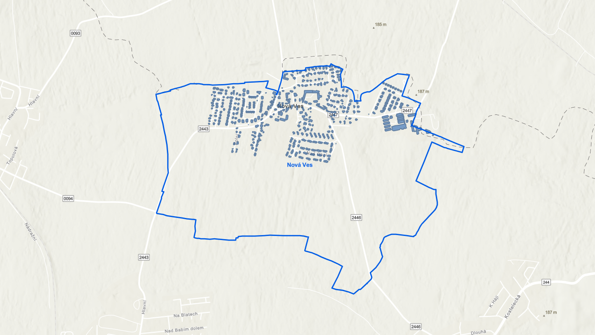
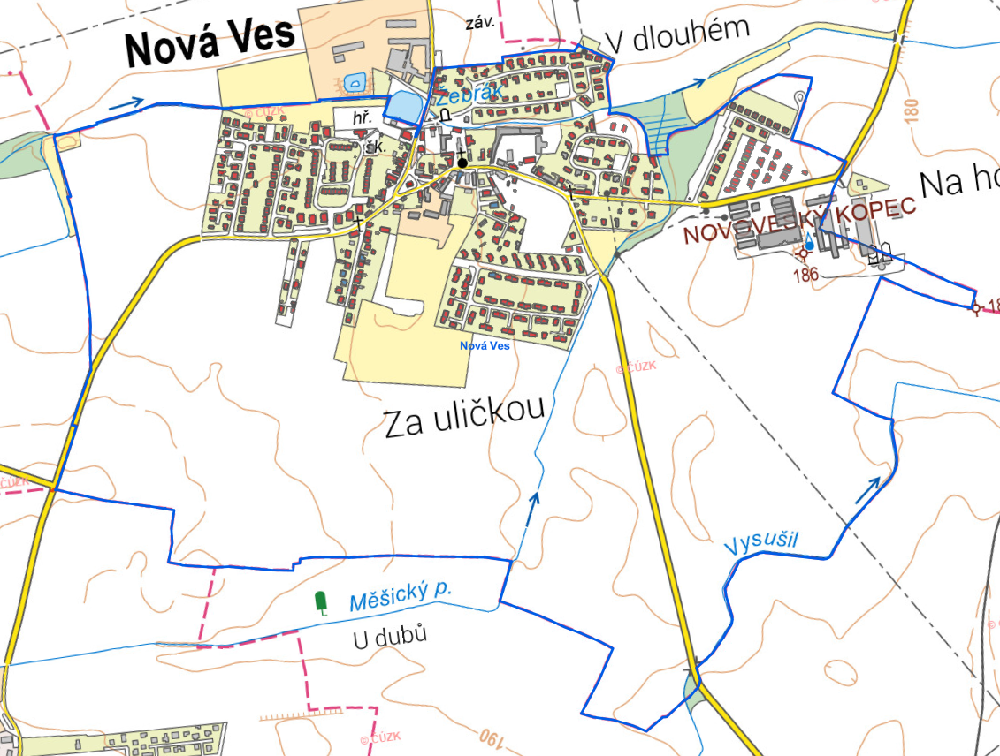

# Tvorba webové mapy, export dat

## Cíle cvičení

 <!-- specificky format gridu (trida "grid_icon_info") na miru uvodni strance predmetu -->

-   :material-map-search-outline:{ .xl }

    vytvoření __interaktivní webové mapy__ s vlastním obsahem

-   :material-chart-box-multiple:{ .xl }

    procvičení jednoduchých __GIS analýz__

-   :material-map-marker-multiple-outline:{ .xl }

    nastavení základní __mapové symbologie__

-   :material-export:{ .xl }

    __export dat__ pro použití v CAD software

## Základní topografická mapa a ZABAGED

**Základní topografická mapa ČR (ZTM ČR)**

Základní topografické mapy ČR představují soubor mapových děl, které poskytují podrobné a aktuální informace o území České republiky. Jedná se o nejpodrobnější obecně topografické mapové dílo České republiky. Mapy jsou vytvářeny v měřítcích od 1 : 5000 po 1 : 200 000, s přehlednými mapami o půlmilionovém a milionovém měřítku) a slouží jako základní zdroj geografických dat pro široké spektrum uživatelů, včetně veřejné správy, odborníků i veřejnosti. 
ZTM ČR se vytváří digitální technologií z kartografické databáze, která je aktualizována na základě Základní báze geografických dat České republiky (ZABAGED) a databáze geografických jmen České republiky Geonames. Mapy obsahují informace o terénu, vodstvu, sídelní struktuře, dopravní síti, vegetaci a dalších prvcích krajiny.
{style="color:grey;"}

**ZABAGED (Základní báze geografických dat České republiky)**

ZABAGED je vektorový geografický digitální model území České republiky, který spravuje Zeměměřický úřad. Tato databáze obsahuje podrobné a aktuální informace o polohopisu, výškopisu a dalších geografických prvcích území ČR, v měřítku odpovídajícím minimálně referenční hodnotě 5000, mnohdy ale v úrovni podrobnější. ZABAGED je základním zdrojem dat pro tvorbu ZTM ČR a dalších geografických informačních systémů. 
ZABAGED představuje důležitý zdroj dat pro analýzu území, tvorbu map a 3D modelů či vizualizací. Je využívána jako základní informační vrstva v územně orientovaných informačních a řídících systémech veřejné správy ČR.
{style="color:grey;"}

## Zadání úlohy

Pomocí mapových služeb od ČÚZK vytvořte __dvojici webových map__ dle individuálního zadání níže. 

**Mapa I** bude obsahovat budovy (stavební objekty) v zadané obci __barevně rozlišené dle připojení na kanalizaci a plyn__.
**Mapa II** bude zobrazovat v zadané ORP __rekreační potenciál__ pomocí metody intenzity jevu (heat map).

??? task-fg-color "Individuální zadání"

    <iframe src="https://docs.google.com/spreadsheets/d/e/2PACX-1vRxRPIWMyUuEA30Y8UhDF8f-T56L_N9MBSQeZ5eaw8GshZeA9MeO4aFCUhp3AnsT65sS3914Sjd8elH/pubhtml?gid=1732083778&single=true" width="100%" height="500" frameBorder="0"></iframe>

## Mapa I – Pracovní postup

- Do prázdné mapy v ArcGIS Online __přidejte vrstvu__ __:material-layers-triple: SGEA_obce_2024__{.bg}. Tato vrstva obsahuje polygony území všech obcí v ČR.__(1)__{title="ukázka"}

- Vrstvě __nastavte :material-filter: filtr dle kódu__ (v krajním případě dle názvu) __zadané obce__. Filtr omezí zobrazení prvků pouze na jednu zadanou obec.__(2)__{title="ukázka"}

- Do mapy dále __přidejte vrstvu__ __:material-layers: RÚIAN__{.bg}, __podvrstvu__ __:material-layers-triple: StavebniObjekt__{.bg} z [__Geoportálu ČÚZK__](https://geoportal.cuzk.cz/ "Služby → Prohlížecí → Esri ArcGIS Server (nebo WMS)"){.color_def .underlined_dotted .external_link_icon target="_blank"}. Tato vrstva obsahuje polygony všech stavebních objektů v ČR.__(3)__{title="ukázka"}

- __Prostorovou analýzou__ (nástroj __:material-tools: Overlay Layers__{.bg}) __vytvořte vrstvu stavebních objektů pouze na území zadané obce__.__(4)__{title="nastavení parametrů nástroje"}__(5)__{title="ukázka výsledku"}

    - nastavte mapové okno tak, aby byla __viditelná celá hranice zadané obce__ a *parametr __"Processing Extent"__ nastavte na __"Display Extent"__*{.primary_color .no-dec} (parametr omezí výpočet na rozsah mapového okna, výrazně se tím sníží cena výpočtu)

- Pomocí stylů __nastavte budovám symbologii dle atributu "Připojení na kanalizační síť"__. Kategorie typu `nedefinováno`, `nezjištěno`, `null`, `žádná hodnota` apod. musí mít nastavenou __neutrální šedou barvu__{.primary_color} (dle kartografických zvyklostí). Barvy výplně zvolte dle citu, volitelně přidejte i barevné ohraničení.__(6)__{title="ukázka"}

- Vrstvu duplikujte a nově vytvořené kopii __nastavte symbologii dle atributu "Připojení na rozvod plynu"__. V seznamu vrstev __změňte číselné kategorie na slovní popisy__{.primary_color} dle následujícího klíče:

 <!-- https://squidfunk.github.io/mkdocs-material/reference/grids/#using-generic-grids -->

__:material-pipe: Připojení na kanalizační síť__
{align="center" style="margin:0px;"}

|KÓD| NÁZEV                     |
|---|---------------------------|
| 1 | Přípoj na kanalizační síť |
| 2 | Vlastní ČOV               |
| 3 | Žumpa, jímka, septik      |
| 4 | Bez kanalizace a jímky    |
| 8 | Nedefinováno              |
| 9 | Nezjištěno                |

__:material-gas-burner: Připojení na rozvod plynu__
{align="center" style="margin:0px;"}

|KÓD| NÁZEV                |
|---|----------------------|
| 1 |Plyn z veřejné sítě   |
| 2 |Plyn z dom. zásobníku |
| 3 |Bez plynu             |
| 8 |Nedefinováno          |
| 9 |Nezjištěno            |
| 51|Plyn v domě           |

- Přidejte __Základní topografickou mapu (S-JTSK)__ od ČÚZK či __ortofoto (S-JTSK)__ od ČÚZK __jako podkladovou mapu__{.primary_color}.__(7)__{title="ukázka"}

    - Aby se vrstva přidala jako podkladová mapa (Basemap), je nutné ji přidat tlačítkem __:material-button-cursor: Použít jako podkladovou mapu__{.bg} (Use a basemap)
    - Nastavením podkladové mapy v souřadnicovém systému JTSK dojde ke správnému zarovnání budov s podkladovou mapou.

<!-- NEFUNGUJE MI TA ZMENA PROJEKCE, U TETO VRSTVY TO TREBA FUNGUJE: geoappext.nrcan.gc.ca/arcgis/rest/services/BaseMaps/CBMT3978/MapServer -->

- Vrstvám s klasifikací budov __nastavte exkluzivní viditelnost__{.primary_color .underlined_dotted title="funguje pouze na seskupené vrstvy"}, aby byla při přepínání viditelná vždy pouze jedna z nich. Zachovejte viditelnost vrstvy s obvodem obce, __ostatní vrstvy z mapy odstraňte__{.primary_color}.__(8)__{title="ukázka"}

- __Webovou mapu uložte__ s názvem "Jmeno_Prijmeni_SGEA2025" a __nastavte sdílení v rámci oganizace__{.primary_color} nebo __veřejné__{.primary_color}.

- Vyučujícímu odevzdejte __URL adresu webové mapy__.__(9)__

???+ task-fg-color "Výstup cvičení (Mapa I): Webová mapa (ukázka)"

    <iframe width="100%" height="400" frameborder="0" scrolling="no" marginheight="0" marginwidth="0" src="https://experience.arcgis.com/experience/0e6a7769af1d479489af74e2f98ca195"></iframe>

<!--

{width=500px}
{align=center}
<figcaption>ukázka správného výsledku (webová mapa)</figcaption>

-->

---

## Mapa II – pracovní postup

<!--
- ~~Obě vrstvy (stavební objekty i obvod zadané obce) __exportujte do formátu Shapefile__ a __stáhněte na disk počítače__.~~

- ~~Shapefile __konvertujte do formátu DXF__. Použijte například [tento](https://mygeodata.cloud/converter/shp-to-dxf){.color_def .underlined_dotted .external_link_icon target="_blank"} webový nástroj.~~

- ~~Konvertovaný soubor otevřete v CAD software a __vytvořte jednoduchý výkres__ obsahující pouze __obvod zadané obce__ a (jinou barvou) __obvody stavebních objektů__ v ní. Všechny objekty musí být ve formě linií. Výkres odevzdejte ve formátu PDF.~~

- Obě vrstvy (stavební objekty i obvod zadané obce) otevřete v programu __:simple-autocad: AutoCAD__ (pomocí doplňku [ArcGIS for AutoCAD](https://www.esri.com/en-us/arcgis/products/arcgis-for-autocad/overview){.color_def .underlined_dotted .external_link_icon target="_blank"})

- Vytvořte __jednoduchý výkres__ – kresbě nastavte __vhodnou symbologii__, přidejte __text s názvem obce__  a __exportujte do PDF__ (formát stránky A4), tento __výstup odevzdejte__.

???+ task-fg-color "Výstup cvičení (část druhá): Výkres (ukázka)"

    <iframe src="https://drive.google.com/file/d/1MSAjhVjESNXBqnbiRNS2tz16X78QGy1Q/preview" width="100%" height="400" style="border:0;"></iframe>

- Pomocí :simple-arcgis: ArcGIS Pro (desktopová verze platformy ArcGIS, mimo rozsah kurzu) lze CAD výkres generovat s rozlišením vrstev dle atributu (tedy například rozlišit stavební objekty dle připojení na kanalizační síť i v CAD výkresu)

{width=500px}
{align=center}
<figcaption>ukázka správného výsledku (CAD výkres)</figcaption>

-->

Do prázdné mapy na ArcGIS Online přidejte vrstvu *budov individuální a hromadné rekreace* __:material-layers-triple: Stav_objekty_rekr_BOD__{.bg}. Jedná se o bodovou vrstvu budov, jež jsou typu ***stavba pro rodinnou rekreaci*** (`Způsob využití = 8`) nebo ***stavba ubytovacího zařízení*** (`Způsob využití = 11`). Úkolem je vytvořit mapu zadané ORP  s tematikou rekreačního potenciálu, kde navíc nakonfigurujete vyskakovací okno s grafem, který bude prezentovat výstavbu za poslední dekády v jednotlivých obcích (atributy začínající slovem *Výstavba*). Obce jsou opět k dispozici ve vrstvě __:material-layers-triple: SGEA_obce_2024__{.bg} na ArcGIS Online. 

Polygony obcí doplňte popisem (*Enable Labels / Configure Labels* v kontextovém menu vrstvy).

 <!-- pro anotace -->

1.  { .no-filter width=700px} vrstva obcí
2.  { .no-filter width=700px} filtr dle kódu obce
3.  { .no-filter width=700px} vrstva "RÚIAN/StavebniObjekt"
4.  { .no-filter width=200px}  parametry nástroje "Overlay Layers"
5.  { .no-filter width=700px} výsledná vrstva (budovy jsou pouze uvnitř hraice obce)
6.  { .no-filter width=700px} změna symbologie (barva výplně a obrysu)
7.  { .no-filter width=700px} změna podkladové mapy (Základní topografická mapa)
8.  { .no-filter width=700px} exkluzivní viditelnost skupiny vrstev v legendě
9.  __Příklad odevzdaného odkazu:__ https://ctuprague.maps.arcgis.com/apps/mapviewer/index.html?webmap=21df15ae2ca9458794a16a8fd9078b78

## Výstupy cvičení

Povinnými výstupy úlohy jsou dvě __webové mapy__{.outlined}. Webová mapa je po uložení a nastavení sdílení přístupná přes __URL adresu__, kterou je nutné odeslat vyučujícímu. Tyto výstupy __není nutné odevzdat přes systém Moodle__.

Úloha je uznána, pokud webové mapy obsahují __všechny požadované náležitosti__ (viz níže).

???+ note-grey "Požadované náležitosti odevzdaných výstupů"
    __Webová mapa__

    - vrstva se stavebními objekty __omezena hranicí obce__, naopak žádné __stavební objekty nesmí chybět__
    - __legenda se slovními popisy__ (nikoli s číselnými kódy)
    - kategorie typu "nedefinováno", "nezjištěno" apod. neutrální __šedou barvou__
    - podkladová mapa – __Základní topografická mapa__ nebo __Ortofoto od Zeměměřického úřadu__
    - na vrstvy rozlišující připojení na kanalizaci a plyn nastavená __exkluzivní viditelnost__ (nesmí být možné je zobrazit současně)
    - sdílení webové mapy nastaveno __"v rámci organizace"__ či __"veřejně"__, __bez správného sdílení k mapě nemá vyučující přístup a nedojde ke kontrole__{style="color:#c22521;" .icon-exclm .no-dec}

### Opravy

V případě, že odevzdaný výstup není správný, je vyučujícím emailem __vrácen k opravě__. Opravený výstup se odevzdává opět prostřednictvím systému Moodle. Výstup lze odevzdat po __maximálně dvou opravách__, v případě pozdního odevzdání či nesprávného výstupu po druhé opravě je úloha __trvale označena jako nesplněná__{style="color:#c22521;"}.

[Tabulka hodnocení úloh](../hodnoceni.md){ .md-button .md-button--primary }
{align=center}

     

<!--

-->